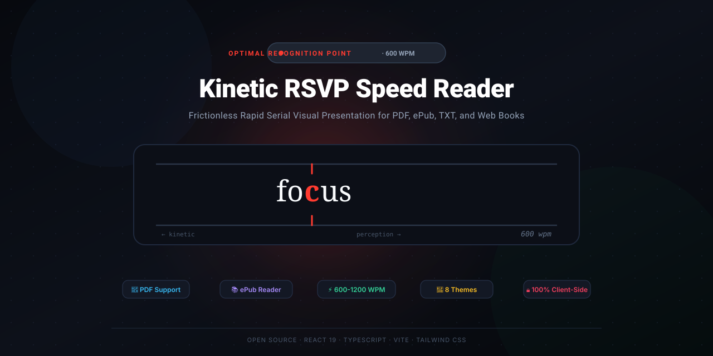

<div align="center">



# Kinetic RSVP Speed Reader Pro

**Read full books at 600+ WPM with frictionless Rapid Serial Visual Presentation (RSVP) & Optimal Recognition Point (ORP) tracking.**

[](https://speedread-rsvp-1791551209.surge.sh)

[](https://github.com/LIN4CRE/SpeedRead/actions)
[](LICENSE)
[](https://react.dev/)
[](https://www.typescriptlang.org/)
[](https://vitejs.dev/)
[](https://tailwindcss.com/)
[](tests/)
[](#offline-pwa-support)
[](#supported-formats)
[](#privacy--security)

[🚀 Live Demo](https://speedread-rsvp-1791551209.surge.sh) · [✨ Features](#key-features) · [🔬 The Science](#the-science-of-rsvp) · [⌨️ Shortcuts](#keyboard-shortcuts) · [📚 Free Ebooks](#free-ebooks-directory) · [🗺️ Roadmap](ROADMAP.md) · [🛠️ Installation](#getting-started) · [🤝 Contributing](CONTRIBUTING.md)

</div>

---

## ⚡ The Problem: Why Traditional Reading is Slow

When reading a physical book or standard screen, your eyes don't glide smoothly—they execute rapid, jerky jumps called **saccades**. 

- **Fixation Overhead:** Your eyes stop on each word cluster for 200–250ms.
- **Involuntary Regressions:** Up to **20%** of reading time is wasted on unconscious backward eye skips to re-read words.
- **Subvocalization Bottleneck:** Traditional reading forces you to pronounce every syllable in your head, limiting speed to human talking speed (~200–250 WPM).

## 🎯 The Solution: Stationary ORP Reticle

**Rapid Serial Visual Presentation (RSVP)** eliminates eye movement altogether. By flashing words sequentially at a fixed physical coordinate:
1. **Your eyes remain completely still**, eliminating ocular fatigue and saccadic travel time.
2. Every word is mathematically centered on its **Optimal Recognition Point (ORP)**—the physiological sweet spot (approx. 35% into the word) where the visual cortex recognizes word morphology instantly.
3. The ORP letter is locked in place between **vertical notch ticks** and highlighted in vibrant red, allowing your brain to process vocabulary directly into ideas at **600 to 1,000+ words per minute**.
4. **Zero Horizontal Jitter:** An absolute-anchored 40% focal axis guarantees that focal characters never drift horizontally across character widths.

---

## ✨ Key Features

### 📚 Open Ebook Catalog & Direct Stream Ingestion
- **1-Click Classic Streamer:** Instant stream ingestion for curated public domain masterworks (*The Time Machine*, *The Picture of Dorian Gray*, *Sherlock Holmes*, *The Art of War*, *Meditations*) without needing to download files to disk first.
- **OPDS Feed Parser:** Ingest open Atom XML OPDS library feeds directly into your personal bookshelf.

### 📱 Cloudless Device Sync & QR Mirror (<kbd>Y</kbd> Key)
- **Peer-to-Peer QR Mirroring:** Instant SVG QR code and base64 transfer payload to continue reading seamlessly on your smartphone with zero cloud tracking.
- **Zero-Knowledge Passphrase Encryption:** Client-side 256-bit AES-GCM encryption (PBKDF2 SHA-256) via the Web Crypto API for private backups.

### ✂️ Instant Web Clipper & Readability Mode
- **Article Readability Cleaner:** Strips advertisements, tracking scripts, navigation headers, sidebars, and cookie banners to stream web articles straight into RSVP.
- **1-Click Bookmarklet:** Drag the SpeedRead bookmarklet to your browser toolbar to ingest any web article with a single click.

### 🧠 Vocabulary Vault & Spaced Repetition (<kbd>D</kbd> Key)
- **1-Key Vocabulary Bookmarking:** Press <kbd>D</kbd> during playback to save unfamiliar words with their sentence context.
- **Embedded Offline Lexicon:** Built-in dictionary definitions with online API fallback.
- **SuperMemo SM-2 Flashcards:** Interactive spaced repetition review mode with automated interval scheduling.
- **Anki Deck Export:** 1-click export to Anki-compatible TSV decks (`SpeedRead_Vocabulary_Anki.tsv`).

### 👁️ Multi-Word Saccadic Chunking (1, 2, & 3 Word Modes)
- **Fluid Word Grouping (<kbd>W</kbd> Key):** Switch between single-word RSVP, 2-word pairs with dual focal markers, or 3-word saccadic trios centered on the stationary axis.
- **Cognitive Absorption Pacing:** Chunk delays automatically scale to provide the cognitive throughput speedup expected from saccadic absorption without mental overload.

### 📱 Full Offline PWA & Mobile Touch Gestures
- **Offline Service Worker:** Full offline caching for application assets, sample classics, and Google Web Fonts. Installable to home screens on iOS and Android.
- **Touch Gesture Navigation:** 
  - **Horizontal Swipe:** Jump forward or back by 10 words.
  - **Vertical Edge Drag:** Smoothly ramp WPM up or down by ±25 with haptic vibration feedback.
  - **Pinch-to-Scale:** Zoom font size dynamically directly on the reticle letterbox.
  - **Two-Finger Tap:** Instant play/pause toggle.

### 📖 Dyslexia Focus Ruler & Bionic Reading
- **Dyslexia Focus Ruler:** High-contrast reading band highlighting the reticle letterbox to prevent line jumping and visual wandering.
- **Bionic Reading Preview:** Bolded initial syllable fixation characters in the synchronized Context Peek to anchor peripheral saccades.

### 🎬 Cinematic Video-Style Reticle (As Seen on Speed Reading Challenges)
- **Letterbox Slot Mode:** Pitch black OLED background (`#000000`) framed by top and bottom guidelines.
- **Precision Notch Ticks:** Upper tick descending and lower tick ascending to frame the focal character with zero jitter.
- **Corner Velocity Indicator:** Discrete `{wpm} wpm` badge in the corner.
- **Tap Anywhere to Play/Pause:** Tap the reader box to toggle flow on touchscreens.

### 📚 Full Book Support: PDF & ePub Ingestion
- **Native PDF Parsing (`pdfjs-dist`):** Extracts text page-by-page, extracts titles and metadata, and provides page jumps.
- **Native ePub Parsing (`jszip`):** Parses ePub packages directly in the browser, cleans HTML boilerplate, preserves chapter titles, and generates a Table of Contents.
- **Drag-and-Drop Anywhere:** Drag any `.pdf`, `.epub`, or `.txt` file onto the window to begin reading immediately.
- **Clipboard Paste:** Paste essays, articles, or news snippets with instant word count analysis.
- **Persistent Bookmarks:** Automatically saves your reading position, chapter, and speed in `localStorage` so you can finish full novels over multiple sessions.

### ⏱️ Native Web Audio Metronome Pacer (<kbd>M</kbd> Key)
- **Acoustic Cadence Ticker:** Micro-acoustic woodblock tick synthesized on the fly via the Web Audio API without speech synthesis lag.
- **Cadence Anchoring:** Prevents attention drift and locks your cognitive cadence at speeds up to 1,200 WPM.
- **Configurable Volume:** Adjustable volume in settings or toolbar.

### 🎧 'Read-Aloud' Multi-Sensory Audio Mode (<kbd>V</kbd> Key)
- **Web Speech API Integration:** Synthesizes audio for the active reticle text in real time.
- **Auditory + Visual Reinforcement:** Listen while reading to anchor comprehension and accelerate reading fluency.
- **Dynamic Rate Scaling:** Automatically matches audio pitch and rate to your current reading speed with browser throttling protection.

### 🎯 Multi-Style Reticle Tracking System (<kbd>S</kbd> Key)
Toggle between customizable visual focal guides to suit your cognitive tracking style:
- **Standard Line:** Vertical alignment guideline passing through the Optimal Recognition Point (ORP).
- **Highlighter:** Translucent colored ambient glow box highlighting the word and focal point.
- **Spotlight:** Radial illumination target focusing attention on the focal character while fading distractions.
- **Underline:** Kinetic underline tracking beneath the current word with an ORP anchor marker.
- **Cinema Notch:** Letterbox drill notch ticks as seen in speed reading drills.
- **Classic Ticks:** Dual vertical ticks at the 40% focal axis.
- **Crosshairs, Brackets, Laser Beam, & Minimal Dot.**

### 🎨 Custom Themes & Visual Customization
- **8 Themes:** Void Obsidian, OLED Pure Black, Warm Parchment (traditional book paper), Solarized Dark, Solarized Cream, Nordic Frost, Midnight Emerald, and Clean Studio White.
- **9 Focal Accent Swatches:** Crimson Neon, Sunset Coral, Amber Gold, Emerald Mint, Electric Cyan, Cobalt Blue, Vibrant Violet, Hot Magenta, and Optic White.
- **6 Typefaces:** *Merriweather* (book serif), *JetBrains Mono*, *Fira Code*, *Space Mono*, *Inter*, and *Atkinson Hyperlegible* (engineered by the Braille Institute for high character distinction and dyslexia).

### 🧠 Intelligent Pacing & Information Surprisal Engine
Reading speed isn't robotic—the brain needs microscopic pauses to synthesize clauses:
- **Information Surprisal Multiplier:** High-frequency functional stop words (*the, and, of, in*) are accelerated (~0.88x), while polysyllabic, hyphenated, and acronym terms (*epistemological, NASA*) dwell longer (~1.10x–1.20x) to protect working memory.
- **Sentence End Pause (. ! ?):** Configurable 2.5x multiplier.
- **Clause Pause (, ; : —):** Configurable 1.7x multiplier.
- **Long Word Modifier (>8 chars):** Micro-delay for complex morphological decoding.
- **Numeric Sequences:** Delay multiplier for numbers and currency.
- **Paragraph Transition Pause:** Pacing cushion between paragraphs.

### 📝 Interactive Retention & Comprehension Quiz (<kbd>Q</kbd> Key)
Verify reading retention and diagnose cognitive overload:
- **3-Question Verification:** Generates Cloze fill-in-the-blank questions, contextual vocabulary checks, and thematic sequence recall directly from your read section.
- **True Effective Reading Speed:** Calculates $\text{True WPM} = \text{Raw WPM} \times \text{Retention Score}$ to benchmark genuine comprehension vs. passive scanning.
- **Personalized Coaching:** Diagnostic recommendations (Grades A+ through D) with 1-click pacing calibration.

### 🛡️ Ergonomic Safety: Tab Visibility Auto-Pause
- Never lose your place when switching windows: RSVP playback automatically pauses whenever the browser tab is minimized or hidden.
- Automatically records bookmark state and cookie break place upon tab switch.

### 🔍 Synchronized Context Peek (<kbd>C</kbd> Key)
Lost your train of thought? Toggle the **Context Peek window** to view the active paragraph in real-time with your current word highlighted, and click any word to seek immediately.

---

## ⌨️ Keyboard Shortcuts

| Shortcut | Action |
|:---|:---|
| <kbd>Space</kbd> | Play / Pause reading flow |
| <kbd>Q</kbd> | Interactive retention & comprehension quiz (True WPM) |
| <kbd>K</kbd> | Save States & Cookie Places / Take a Break |
| <kbd>D</kbd> | Bookmark word to Vocabulary Vault (<kbd>Shift</kbd>+<kbd>D</kbd> opens vault) |
| <kbd>Y</kbd> | Cloudless device sync & QR code mirror |
| <kbd>W</kbd> | Cycle saccadic chunk size (1w, 2w, 3w) |
| <kbd>V</kbd> | Toggle Read-Aloud Web Speech audio mode |
| <kbd>M</kbd> | Toggle Audio Metronome Cadence Ticker |
| <kbd>S</kbd> | Cycle Reticle tracking style (Line, Highlighter, Spotlight, Underline, etc.) |
| <kbd>B</kbd> | Toggle Bookshelf & Table of Contents Sidebar |
| <kbd>Z</kbd> | Toggle Zen Focus Mode (pure distraction-free stream) |
| <kbd>←</kbd> / <kbd>→</kbd> | Step backward / forward 10 words |
| <kbd>Shift</kbd> + <kbd>←</kbd> | Jump back to the beginning of current sentence |
| <kbd>↑</kbd> / <kbd>↓</kbd> | Increase / decrease speed by 25 WPM |
| <kbd>C</kbd> | Toggle synchronized paragraph Context Peek |
| <kbd>F</kbd> | Toggle full-screen mode |
| <kbd>T</kbd> | Cycle next color theme |
| <kbd>R</kbd> | Restart book from the beginning |
| <kbd>Esc</kbd> | Close open dialogs / exit Zen mode |

---

## 📖 Supported Formats

| Format | Extensions | Features Supported |
|:---|:---|:---|
| **ePub** | `.epub` | Spine ordering, Table of Contents, chapter jumps, clean text extraction |
| **PDF** | `.pdf` | Page-by-page extraction, page navigation, metadata title/author |
| **Plain Text** | `.txt`, `.md` | Paragraph segmentation, instant tokenization |
| **Clipboard** | Copy / Paste | Real-time word count and reading time estimator |

---

## 🌐 Free Ebooks Directory

Looking for books to read? The app includes a built-in directory linking to over 70,000+ free digital books:

1. **[Standard Ebooks](https://standardebooks.org):** Free, beautifully typeset public domain ebooks (e.g. *Frankenstein*, *Sherlock Holmes*, *The Great Gatsby*).
2. **[Project Gutenberg](https://www.gutenberg.org):** 70,000+ free ebooks across world literature.
3. **[Open Library](https://openlibrary.org):** Millions of books available for digital lending and downloads.
4. **[ManyBooks](https://manybooks.net):** 50,000+ free books across genres (Sci-Fi, Fantasy, Mystery).
5. **[Planet eBook](https://www.planetebook.com):** Handcrafted classic novels formatted for e-readers.

*To read any book:* Download the `.epub` or `.pdf` file from any of the sites above, drag and drop it into Kinetic RSVP Reader, and read at 600 WPM!

---

## 🔒 Privacy & Security

- **100% Client-Side Processing:** All PDF and ePub parsing happens locally in your browser using JavaScript Web APIs and WebAssembly.
- **Zero Cloud Uploads:** No books or reading texts are ever transmitted to any remote server or third-party service.
- **Local Persistence:** Bookmarks and configuration are stored exclusively in your browser's private storage.

---

## 🚀 Getting Started

### Prerequisites
- Node.js (v18 or higher; v20+ / v22+ recommended)
- npm, pnpm, or bun

### Installation

```bash
# Clone the repository
git clone https://github.com/LIN4CRE/SpeedRead.git

# Navigate to the project directory
cd SpeedRead

# Install dependencies
npm install

# Start development server
npm run dev
```

The application will launch at `http://localhost:3000`.

### Testing

Run the automated Vitest test suite:

```bash
# Run all unit tests
npm test

# Run tests in watch mode
npm run test:watch
```

### Production Build

```bash
# Type check and verify
npm run lint

# Compile and bundle for production
npm run build

# Preview production build locally
npm run preview
```

---

## 🚀 Live Deployment

The application is deployed live and can be hosted seamlessly on any static host:

- **Live Production URL:** [https://speedread-rsvp.surge.sh](https://speedread-rsvp.surge.sh)
- **GitHub Pages:** Automated deployment configured via [`.github/workflows/deploy.yml`](.github/workflows/deploy.yml) on push to `main`.
- **Vercel:** Single-page rewrite rules configured via [`vercel.json`](vercel.json).
- **Netlify:** Single-page redirect rules configured via [`netlify.toml`](netlify.toml).

To deploy your own fork to Surge:
```bash
npm run build
npx surge ./dist your-custom-subdomain.surge.sh
```

---

## 🏗️ Architecture & Tech Stack

```
SpeedRead/
├── .github/
│   ├── workflows/
│   │   ├── ci.yml                # Automated CI (lint, test, build matrix)
│   │   └── deploy.yml            # Automated GitHub Pages deployment
│   ├── ISSUE_TEMPLATE/
│   │   ├── bug_report.md         # Standardized bug reporting
│   │   └── feature_request.md    # Feature request template
│   ├── dependabot.yml            # Automated dependency updates
│   └── pull_request_template.md  # PR checklist with RSVP focal checks
├── public/
│   ├── banner.svg                # High-resolution vector repository banner
│   ├── favicon.svg               # High-DPI ORP vector favicon
│   └── manifest.json             # Web App Manifest (PWA)
├── src/
│   ├── books/                    # Complete public domain classic books
│   │   ├── aliceInWonderland.ts
│   │   ├── fairytalesForKids.ts
│   │   ├── peterPan.ts
│   │   ├── wizardOfOz.ts
│   │   └── aesopFables.ts
│   ├── components/
│   │   ├── ReticleDisplay.tsx       # Core zero-jitter RSVP viewer with ORP fixed-axis pinning
│   │   ├── Controls.tsx             # Playback bar, velocity scrubber, speed dial & metronome
│   │   ├── Sidebar.tsx              # Slide-out bookshelf, file uploader, chapters & bookmarks
│   │   ├── SettingsModal.tsx        # Typography, theme & pacing engine tuning
│   │   ├── ReadingInsightsModal.tsx # WPM progression & reading velocity analytics
│   │   ├── SaveStateModal.tsx       # Multi-slot bookmarks & cookie break management
│   │   ├── EyeRestModal.tsx         # 25-min Pomodoro eye rest timer & breathing pacer
│   │   ├── FreeBooksModal.tsx       # Curated directory of free ebook archives
│   │   ├── ContextPeek.tsx          # Real-time synchronized paragraph drawer
│   │   └── KeyboardShortcutsModal.tsx # Hotkey cheat sheet
│   ├── hooks/
│   │   ├── useSpeechRecognition.ts  # Hands-free voice cadence and speed commands
│   │   └── useSpeechSynthesis.ts    # Multi-sensory text-to-speech audio reader
│   ├── utils/
│   │   ├── audioPacer.ts            # Zero-latency Web Audio API cadence ticker
│   │   ├── orp.ts                   # Optimal Recognition Point calculation & Unicode tokenization
│   │   ├── pdfParser.ts             # Client-side PDF.js text extractor
│   │   ├── epubParser.ts            # Robust client-side JSZip ePub package reader
│   │   ├── sampleTexts.ts           # Curated public domain sample library
│   │   ├── cookieUtils.ts           # Browser cookie break persistence
│   │   ├── saveStateManager.ts     # Multi-account state storage
│   │   ├── storage.ts               # LocalStorage settings and analytics
│   │   └── themes.ts                # 8 Curated color themes and focal accents
│   ├── types/
│   │   └── reader.ts                # TypeScript interfaces
│   ├── App.tsx                      # Root application coordinating state & hotkeys
│   ├── main.tsx                     # React 19 entry point
│   └── index.css                    # Tailwind CSS v4 styling & animations
├── tests/
│   ├── orp.test.ts                  # ORP calculation, punctuation delay, Unicode tests
│   ├── cookieUtils.test.ts          # Resilient cookie storage tests
│   ├── sampleTexts.test.ts          # Public domain book catalog tests
│   └── audioPacer.test.ts           # Audio metronome unit tests
├── .editorconfig
├── .prettierrc
├── vercel.json
├── netlify.toml
├── CHANGELOG.md
├── CONTRIBUTING.md
├── CODE_OF_CONDUCT.md
├── SECURITY.md
├── LICENSE
└── package.json
```

---

## 🤝 Community & Contributing

We welcome contributions! Please review our:
- [Product Roadmap](ROADMAP.md)
- [Contributing Guide](CONTRIBUTING.md)
- [Code of Conduct](CODE_OF_CONDUCT.md)
- [Security Policy](SECURITY.md)
- [Changelog](CHANGELOG.md)

---

## 📄 License

This project is open-source software licensed under the **[MIT License](LICENSE)**.
