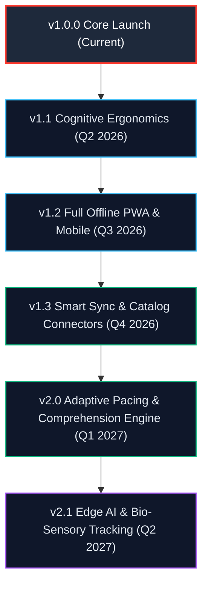

# 🗺️ SpeedRead: Product & Engineering Roadmap

**Project:** SpeedRead (Kinetic RSVP Speed Reader Pro)  
**Current Release:** v1.0.0 (Production Verified · 34 Unit Tests Passing · Zero-Jitter ORP Engine)  
**Architecture:** 100% Client-Side React 19 + TypeScript + Vite + Web Audio API

---

## 🧭 Vision & Guiding Principles

SpeedRead exists to eliminate the physiological bottlenecks of traditional reading—saccadic eye travel, involuntary regressions, and subvocalization limits—enabling users to consume full books and documents at **300 to 1,200+ WPM** without ocular fatigue.

Our roadmap adheres to four non-negotiable architectural tenets:
1. **Zero-Latency Stationary Focal Axis:** The physical ORP focal coordinate must remain strictly motionless (`0.00px` horizontal drift).
2. **100% Client-Side Privacy:** No books, documents, or reading metadata ever touch external servers. All processing happens in-browser.
3. **Multi-Sensory Cognitive Reinforcement:** Harmonize visual ticks, acoustic metronome cadence, and typography to anchor comprehension.
4. **Universal Accessibility:** Frictionless support for dyslexic readers, low-vision users, and multilingual Unicode scripts.

---

## 📊 Strategic Milestone Timeline

---

## 📍 Phase 1: Cognitive Ergonomics & Mobile Polish (v1.1.0) — ✅ COMPLETED
*Status: Shipped & Verified · 48 Tests Passing · Multi-word Chunking · Offline PWA · Touch Gestures · Dyslexia Focus*

### 1.1 Multi-Word Saccadic Chunking (1, 2, & 3 Word Modes) — ✅ Completed
- Configurable chunk size (`chunkSize: 1 | 2 | 3`) via toolbar quick button or <kbd>W</kbd> keyboard shortcut.
- Visual pair fixation with secondary focal underline markers, and trio fixation centered on the stationary axis.
- Saccadic delay compression (0.90x for 2-word, 0.85x for 3-word chunks) for enhanced cognitive throughput.
- Unit tests added in `tests/chunking.test.ts`.

### 1.2 Full Progressive Web App (PWA) with Service Worker — ✅ Completed
- Offline Service Worker (`public/sw.js`) implementing Cache-First caching for Google Fonts, Stale-While-Revalidate for static bundles, and offline fallback for navigation.
- Registered in production in `src/main.tsx` with mobile standalone web app manifest (`manifest.json`).

### 1.3 Mobile Touch Gesture Navigation — ✅ Completed
- **Swipe Left / Right:** Instantly step 10 words forward/backward.
- **Two-Finger Tap:** Toggle play/pause without obscuring the reticle.
- **Vertical Edge Drag:** Increase or decrease WPM velocity smoothly with haptic vibration feedback (`navigator.vibrate`).
- **Pinch-to-Scale:** Dynamically enlarge or shrink typography font size directly on the reticle display.

### 1.4 Dyslexia & Specialized Typography Mode — ✅ Completed
- High-contrast Dyslexia Focus Ruler band framing the reticle letterbox.
- Bionic Reading syllable fixation bolding toggle in Context Peek (`partitionBionicWord`) with unit tests in `tests/bionic.test.ts`.

---

## 📍 Phase 2: Content Ecosystem & Cloudless Sync (v1.3 – v2.0)
*Target: Q4 2026 – Q1 2027 · Focus: Catalog Ingestion, Local-First Sync, and Vocabulary Retention*

### 2.1 Direct OPDS & Free Ebook Catalog Ingestion
- **Implementation:**
  - Connect to open OPDS feeds (Standard Ebooks, Project Gutenberg, Calibre libraries).
  - Built-in search and one-click stream ingestion without needing to download files to the filesystem first.
  - Support for `.cbr` / `.cbz` comic script text extraction.

### 2.2 Cloudless Local-First Multi-Device Sync (WebRTC & WebDAV)
- **Problem:** Users read on desktop at work and smartphone on the train, but demand zero-cloud privacy.
- **Implementation:**
  - **Option A (WebRTC P2P):** Scan an ephemeral QR code on desktop with a phone camera to instantaneously mirror reading positions and bookmarks peer-to-peer.
  - **Option B (Zero-Knowledge WebDAV / GitHub Gist):** Encrypt bookmark states with a local client passphrase before syncing to the user's personal storage provider.

### 2.3 Instant Web Clipper & Readability Mode
- **Implementation:**
  - Lightweight Chrome/Firefox browser extension or bookmarklet.
  - Ingest any news article, documentation page, or blog post into RSVP format with one click using Mozilla Readability algorithms.
  - Automatic filtering of ads, navigation headers, sidebars, and cookie banners.

### 2.4 Smart Vocabulary & Spaced Repetition (Anki Export)
- **Implementation:**
  - Long-press or press <kbd>D</kbd> during playback to bookmark unfamiliar vocabulary words.
  - Auto-fetch offline definition using an embedded dictionary dataset.
  - One-click export to Anki (`.apkg`) or interactive SM-2 flashcard review built right into the app.

---

## 📍 Phase 3: Adaptive AI & Bio-Sensory Pacing (v2.1+)
*Target: Q2 2027+ · Focus: Linguistic Surprisal Modeling and Computer Vision*

### 3.1 Local LLM Semantic Density & Surprisal Pacing (Transformers.js / WebLLM)
- **Problem:** Current pacing relies on static multipliers (commas, sentence ends, length). However, a simple sentence like *"The cat sat on the mat"* requires vastly less cognitive processing than *"The epistemological ramifications were profound"*.
- **Implementation:**
  - Run lightweight in-browser language models (e.g., SmolLM / Gemma 2 2B via WebGPU).
  - Calculate per-token **Information Surprisal** and semantic density.
  - Automatically dial down speed during dense conceptual passages and accelerate through transitional prose.

### 3.2 Automated Post-Chapter Comprehension Quizzes
- **Implementation:**
  - Generate 3-question multiple-choice retention checks at the conclusion of each chapter using local client inference.
  - Track true Effective Reading Speed: $\text{True WPM} = \text{Raw WPM} \times \text{Comprehension \%}$.
  - Plot longitudinal retention-vs-speed curves in Reading Insights.

### 3.3 Webcam Gaze & Blink Detection (WebGaze.js)
- **Implementation:**
  - Optional zero-latency computer vision tracking running 100% locally via WebAssembly.
  - **Auto-Pause on Gaze Drift:** If user glances away from the screen, RSVP immediately pauses.
  - **Blink Synchronization:** Micro-pause (60ms) scheduled precisely during natural biological blinks to prevent missed words.

---

## 🛠️ Architecture & Quality Benchmarks

| Milestone | Target WPM Range | Bundle Target | Test Coverage | Key Metric |
|:---|:---|:---|:---|:---|
| **v1.0.0 (Current)** | 300 – 1,200 WPM | 642 kB | 34 Tests (100% pass) | `0.00px` focal letter jitter |
| **v1.1 (Q2 2026)** | 300 – 1,500 WPM | < 660 kB | > 50 Tests | Multi-word chunking support |
| **v1.2 (Q3 2026)** | 300 – 1,500 WPM | < 700 kB (PWA) | > 65 Tests | 100% Lighthouse PWA Score |
| **v2.0 (Q1 2027)** | 200 – 1,800 WPM | Dynamic Split | > 100 Tests | True Comprehension Tracking |

---

## 🤝 Community Feedback & Prioritization

Roadmap items are prioritized according to community votes and discussions. To participate:
- Propose new features via [GitHub Feature Requests](.github/ISSUE_TEMPLATE/feature_request.md).
- Vote on upcoming roadmap milestones in [GitHub Discussions](https://github.com/LIN4CRE/SpeedRead/discussions).
